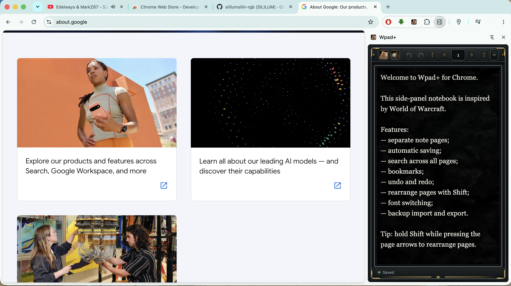
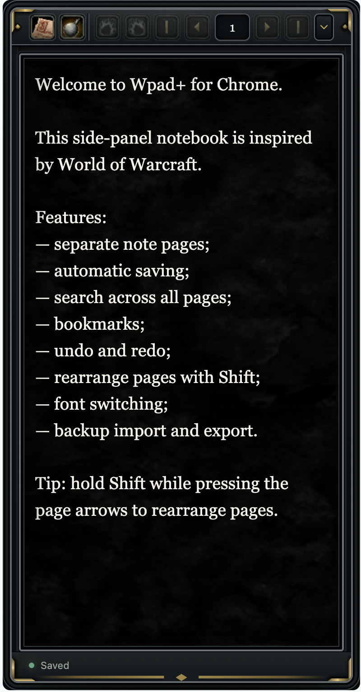

# Wpad+

Wpad+ is a compact page-based notebook for the Google Chrome side panel, with an interface inspired by World of Warcraft.

## Features

- Separate note pages with automatic saving
- Search across all pages
- Bookmarks for quick navigation
- Undo and redo
- Page rearranging with `Shift`
- Several editor fonts
- Russian and English interface languages
- JSON backup import and export
- Export of the current page as a TXT file
- Compact collapsible toolbar

All notes stay in the browser's local extension storage. Wpad+ does not read websites, browsing history, or page content. The only requested Chrome permission is access to the Side Panel API.

## Download and install

1. Download [`WpadPlusChrome.zip`](WpadPlusChrome.zip).
2. Extract the archive to a permanent folder.
3. Open `chrome://extensions` in Google Chrome.
4. Enable **Developer mode**.
5. Click **Load unpacked** and select the extracted `WpadPlusChrome` folder.
6. Click the Wpad+ extension icon to open the notebook in the side panel.

Chrome 114 or newer is required.

## Interface

## Credits

Created by **Sililum**.

Wpad+ is an unofficial fan-made project inspired by World of Warcraft. It is not affiliated with or endorsed by Blizzard Entertainment.
